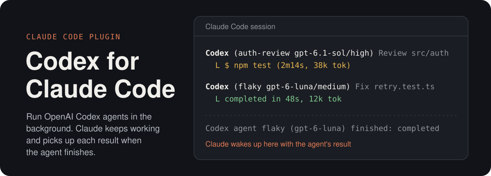
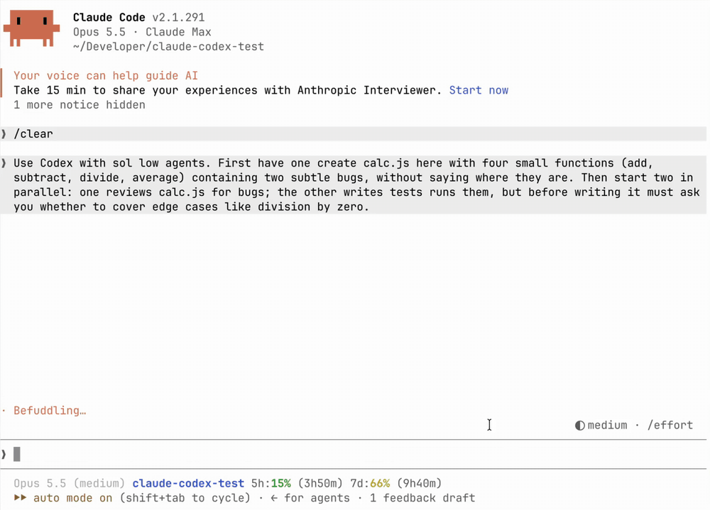
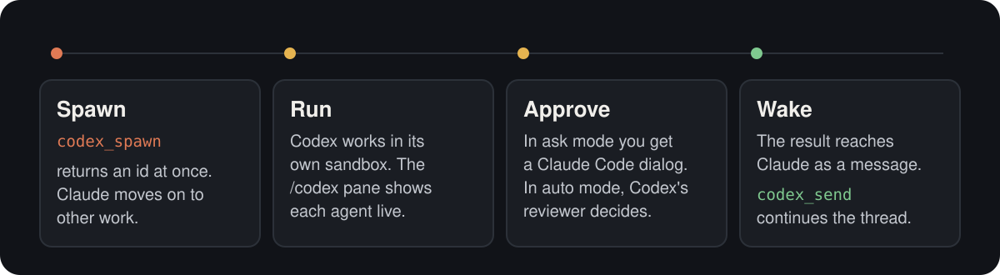
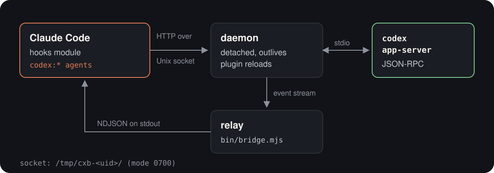

<p align="center">
  
</p>

A Claude Code plugin that runs OpenAI Codex (luna, sol, astra, terra) as native Claude Code background subagents. Claude hands a task to a `codex:sol` agent through its own Agent tool and carries on. The job shows in the native task list, `SendMessage` and `TaskStop` reach it, and when Codex finishes, the native `Agent "<description>" finished` notification brings Claude the Codex final message, word for word. Codex approval requests show up as Claude Code dialogs.

<p align="center">
  
</p>

## How it works

<p align="center">
  
</p>

The plugin registers four agent types, one per Codex model: `codex:luna`, `codex:sol`, `codex:astra` and `codex:terra`. Claude uses them like `general-purpose`, so you can ask in plain words, for example "have a Codex agent fix the flaky retry test". Claude turns that into an Agent call like this:

```json
{ "subagent_type": "codex:sol", "description": "Fix flaky retry test", "prompt": "effort: medium\nFix the flaky test in retry.test.ts and run it." }
```

### Which agent Claude picks

Each agent type's description in Claude's agent listing opens with when to use it, so Claude routes by it:

| Agent type | Model | Default effort | Use it for |
| --- | --- | --- | --- |
| `codex:sol` | `gpt-6.1-sol` | high | Normal tasks: implementation, debugging, analysis, review, anything needing judgement. The default. |
| `codex:luna` | `gpt-6-luna` | max | Simple mechanical work and searches: find/grep/list, bulk renames, boilerplate, straightforward well-specified edits, data gathering. Cheap and fast. |
| `codex:astra` | `gpt-6-astra` | high | Only when you ask for astra explicitly. |
| `codex:terra` | `gpt-5.6-terra` | high | Only when you ask for terra explicitly. |

What happens then:

- The plugin starts the Codex thread and turn itself, with the Agent call's prompt exactly as given (header lines taken off), in the Agent call's `cwd` or the session's. Nothing is relayed through a Claude model.
- The agent the engine starts for it is a thin wrapper. Every model request of its loop is answered by the plugin (a `turn.step` hook): while Codex works, the wrapper calls the plugin's `codex_await` tool, and once the Codex turn ends, it hands back the Codex final message, verbatim. Where the engine requires a background subagent to report through `SubagentHandback` (auto mode), that call carries it; where the engine does not offer that tool, the failed call is followed by the message as the final text. No Claude model runs for it, so it costs no Claude tokens.
- The wrapper is a real background subagent: it is in the task list ("↓ to manage"), and its finish row and the notification Claude reads are the engine's own.
- `SendMessage` to the agent (by its agentId, or the `name` the Agent call gave) goes to Codex first: it steers the running turn, or, once the agent finished, starts a new turn on the same Codex thread and resumes the agent, which then notifies again. If Codex refuses the message, `SendMessage` reports it as not delivered.
- Codex can message the session mid-task (see Messages from Codex below), and a `SendMessage` reply reaches its running turn.
- `TaskStop`, or stopping the task from the task list, interrupts the Codex turn.

### Prompt header lines

Optional lines at the very top of the prompt, one `key: value` each, set how Codex runs. They are taken off before Codex sees the prompt; everything after them is passed as given.

| Line | Values | Default |
| --- | --- | --- |
| `effort:` | low, medium, high, xhigh, max, ultra (luna does not take ultra) | the model's own (luna max, the others high), unless `defaultEffort` or the project sets one |
| `sandbox:` | read-only, workspace-write, full-access | `defaultSandbox` |
| `approvals:` | auto, ask, never, yolo | `defaultApprovals` |

An effort the model does not take, an unknown sandbox or approvals value, a key given twice, or a prompt with nothing after its header refuses the Agent call before any agent starts. `approvals: yolo` means no sandbox and no approvals; Claude is told to use it only when you asked for it explicitly in the request.

### Messages from Codex

A Codex job can message the Claude session mid-task, as a native background subagent can `SendMessage` to `main`: a question it needs answered, a blocker, or an important interim finding. Each Codex thread gets one extra MCP server, `claude_session` (`bin/codex-msg`, Node, no dependencies), with one tool, `message_claude(text)`, and developer instructions saying when to use it. The tool posts the text to the bridge daemon (`POST /msg`), which holds it for the job's agent; the agent's `codex_await` returns early, and the plugin has the agent send the text to `main` with its own `SendMessage` call, word for word, then wait again. In auto mode the plugin allows that call itself through a `tool.check` hook, only for the call it made: no model request produced the step, so auto mode's classifier has no verdict for it. Claude sees the native message row from that agent. A reply is an ordinary `SendMessage` to the agent, which steers the running Codex turn, so Codex reads it mid-turn as a new user message.

It is an MCP server, not a shell command, because Codex's sandboxes refuse a shell command's `connect()` to the bridge's Unix socket: both `read-only` and `workspace-write` fail with EPERM (tested with `codex sandbox`, Codex CLI 0.160), and only `network_access = true` lifts that, which opens the network too. Codex starts its MCP servers outside the job's sandbox, so `message_claude` works in every sandbox, and in testing it ran without an approval prompt under `approvals: ask`.

Each job is named after the Agent call's description, numbered when another job has it (`Fix flaky retry test`, `Fix flaky retry test (2)`); the Codex thread carries the description too, so the session is easy to find in the Codex app, `codex resume` and `codex agents`.

## Install

At a Claude Code prompt:

```
/plugin marketplace add SSS135/claude-code-codex-plugin
/plugin install codex@codex-plugin
```

Or in one line, answering `y` to add the marketplace and then choosing a scope:

```
/plugin install codex --marketplace SSS135/claude-code-codex-plugin
```

From a shell:

```
claude plugin marketplace add SSS135/claude-code-codex-plugin
claude plugin install codex@codex-plugin
```

### Requirements

- Claude Code with the hooks plugin API (function hooks, currently early access).
- The Codex CLI with `codex app-server`. It ships inside the ChatGPT desktop app on macOS, or you can install it separately.
- Node 18 or newer.
- macOS, Linux or Windows 10/11. On Windows install the Codex CLI with `npm i -g @openai/codex` (or point `codexPath` at a `codex.exe`); Codex runs its shell commands in PowerShell there.

## Tools

Besides the agent types, Claude sees two tools as `mcp__codex__<name>`:

| Tool | Parameters | What it does |
| --- | --- | --- |
| `codex_list` | none | Lists this session's Codex jobs, newest first and at most the latest 10, with model, status, tokens and current activity. |
| `codex_result` | `id`, `full` | Status and final message. With `full=true` it adds the turn digest: commands with exit codes, file changes and messages. |

`id` is the agent's agentId or the job's name (its description, as `codex_list` shows it); `codex_result` reads any job the plugin still holds, including older ones and other sessions'. A third tool, `codex_await`, serves the wrapper agents alone and refuses any other caller.

In the transcript each call is one row like a native one, for example `● Codex(list)` over `⎿  2 agents · 1 running`. While jobs run they are also named at the end of the hint line under the prompt (`codex: Fix flaky retry test (luna)`); the native task list (↓ to manage) shows and stops them.

## Configuration

Set these in the install screen or the plugin's config menu (`userConfig`):

| Option | Default | Meaning |
| --- | --- | --- |
| `codexPath` | `/Applications/ChatGPT.app/Contents/Resources/codex-cli/bin/codex` | The Codex CLI. If the path does not exist, `codex` is looked up on PATH. |
| `nodePath` | `/opt/homebrew/bin/node` | Node used to run the bridge. If the path does not exist, `node` is looked up on PATH. |
| `defaultEffort` | `per-model` | `per-model` uses each model's own default: max for luna, high for sol, astra and terra. Any other value (low, medium, high, xhigh, max, ultra) applies to every model; luna does not take ultra. |
| `defaultSandbox` | `workspace-write` | read-only, workspace-write, full-access. |
| `defaultApprovals` | `auto` | auto, ask, never. |

Both path defaults are macOS paths (Apple Silicon with Homebrew). Elsewhere, either keep them and put `codex` and `node` on PATH, or set absolute paths. An empty path also means PATH. On Windows npm's `codex.cmd` shim cannot run without a shell, so the bridge runs the npm package's `codex.js` with node instead, found beside a configured path or on PATH, or a `codex.exe` found there; `codexPath` may also name a `codex.exe` or `codex.js` directly.

A project can set its own defaults in `.claude/codex.json`. The plugin uses the nearest one found walking up to the project root:

```json
{ "effort": "medium", "sandbox": "workspace-write", "approvals": "ask" }
```

When a setting comes from several places, the prompt's header lines beat the project's `.claude/codex.json`, which beats `userConfig`, which beats the built-in defaults. For effort, the built-in default is per model (luna max, the others high); an `effort` in `.claude/codex.json`, or a `defaultEffort` other than `per-model`, replaces it for every model. The model comes from the agent type: `codex:luna` is `gpt-6-luna` (fast, cheap), `codex:sol` is `gpt-6.1-sol` (strongest, the default for normal work), `codex:astra` is `gpt-6-astra`, and `codex:terra` is `gpt-5.6-terra`.

## Approval modes

- `ask`: you approve each escalation in a Claude Code dialog. The choices are Allow once, Allow for session and Deny, plus Allow always where Codex can save a rule.
- `auto`: Codex's own reviewer decides on escalations. It is looser than Claude Code's auto mode; in testing it approved writes outside the workspace.
- `never`: no escalation. The sandbox alone decides.
- `yolo`: full bypass with no sandbox and no approvals. Claude uses it only when you ask for it explicitly in the request, or when a project's `.claude/codex.json` makes it the default. You cannot set it as a user-wide default.

"Allow always" adds a `prefix_rule` to Codex's own rules file, `~/.codex/rules/default.rules`, managed like any Codex rule. That rule then applies to every Codex session on the machine, including ones started outside this plugin.

## Architecture

<p align="center">
  
</p>

The hooks module starts `bin/bridge.mjs` as a relay (and Codex starts `bin/codex-msg` per thread, which posts to the same socket). The relay launches a detached daemon, or reattaches to one that is still running. The daemon owns `codex app-server` and serves an HTTP API on a Unix socket under `/tmp/cxb-<uid>/` (mode 0700, owned by your user). On Windows, where Node cannot listen on a Unix socket and the plugin API refuses a named pipe, it serves on a random `127.0.0.1` port instead, every path under a random 128-bit secret, and keeps that address in `%TEMP%\cxb\`. The module sends requests over that socket, and the relay streams the daemon's events back to it as NDJSON on stdout.

The bridge exists because the plugin API cannot write to a child process's stdin once it has spawned it, and `codex app-server` speaks JSON-RPC over stdio. The daemon runs detached so that Codex turns keep running through a plugin reload. After a reload the module reattaches, and the job list is restored from the plugin store.

Processes end with the work they serve:

- When a job's turn ends, the plugin unsubscribes from its thread (`thread/unsubscribe`). About a minute later `codex app-server` unloads the thread and stops the MCP servers it started for it: `codex-msg`, and those of Codex's own plugins, such as `computer-history`. A `SendMessage` to the job resumes the thread (`thread/resume`) before its next turn.
- The daemon exits 20 seconds after its relay goes away (the Claude session ended), or after 10 minutes with no turn running and no request. Codex and every MCP server it started exit with it. The plugin starts a new daemon when it next needs one.
- The daemon's directory names the bridge build (its path and code), so a session reloaded onto another plugin version starts a new daemon, and the old one exits once its relay is gone. A daemon started by plugin 0.2.2 or earlier, which never exits on its own while its session lives, is stopped by a newer daemon that has seen it run no turn for 5 minutes.

## Known limits

- The wrapper agent is defined on `haiku`, because an agent type must name a Claude model; the plugin answers every request of its loop, so that model is never called. Where the engine names the agent's model (its task details), it may say haiku; `codex_list` and `codex_result` show the Codex model.
- If the plugin's `turn.step` hook fails for a wrapper request, the engine sends that request to haiku, whose system prompt tells it to call `codex_await` and deliver its result unchanged. A failure is reported in the transcript's dim plugin line.
- In auto mode the hand-back arrives with the engine's note that auto mode's classifier was unavailable for the agent's work: the classifier judges a model's actions with its request, and the wrapper's steps make no request. Only that classifier may allow `SubagentHandback`, so the plugin cannot allow it itself. The report under the note is the Codex final message, verbatim.
- The final message and each `message_claude` message are passed on whole up to 20,000 characters; a longer one is cut there. At most 50 messages wait unread per job.
- Messages are read only while the job's agent runs; one still unread when the bridge daemon exits is lost.
- A Codex thread is started before the Agent call's subagent; if another plugin then refuses the spawn, that thread stays unused.
- The model is chosen by the agent type alone: the four aliases, no other Codex model id.
- Each Agent call starts a new Codex thread. `SendMessage` continues one; there is no way to attach a new agent to an older thread.
- The plugin API does not tell a tool row whether ctrl+o is expanding it, so the text a `codex_*` call returned is not drawn under its row; `codex_result` shows a job's result.
- The running-jobs line under the prompt is drawn on the terminal only.
- Resuming a thread right after Claude Code restarts can take about 20 seconds while Codex reloads it.
- On Windows, which has no SIGTERM, the daemon stops Codex with its whole process tree by force (`taskkill /T /F`), so Codex runs none of its own cleanup on the way out.
- The hooks plugin API is early access and may change between Claude Code releases.

## Development

```
claude plugin validate .
claude plugin test .
claude --plugin-dir .
```

## License

MIT. See [LICENSE](LICENSE).
